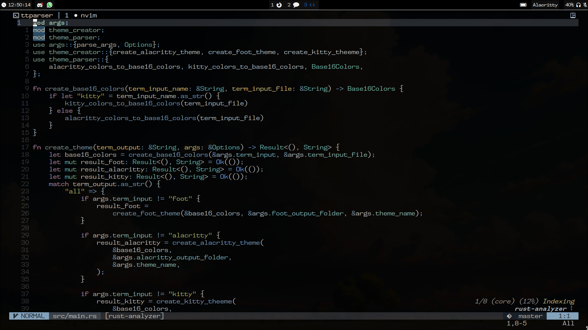

# dotfiles

_WM:_ **[hyprland](https://github.com/hyprwm/Hyprland)**

_statusBar:_ **[waybar](https://github.com/Alexays/Waybar/wiki)**

_terminal:_ **[foot](https://codeberg.org/dnkl/foot)**

_shell:_ **[fish](https://github.com/fish-shell/fish-shell)**

_fetch:_ **[neofetch](https://github.com/dylanaraps/neofetch)**

_code/text editor:_ **[neovim](https://github.com/neovim/neovim)**

_app launcher:_ **[rofi](https://aur.archlinux.org/packages/rofi-lbonn-wayland-git)**

_notifications:_ **[dunst](https://github.com/dunst-project/dunst)**

_pdf reader:_ **[zathura](https://github.com/pwmt/zathura)**

_font:_ **[MesloLG Nerd Font](https://www.nerdfonts.com/font-downloads)**

