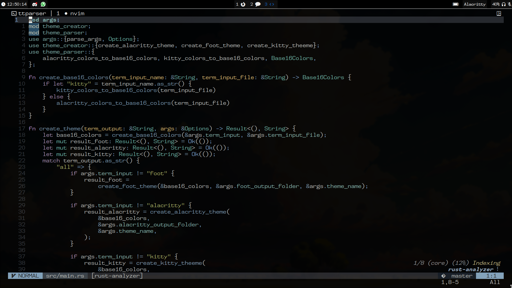

# dotfiles

_WM:_ **[hyprland](https://github.com/hyprwm/Hyprland)**

_statusBar:_ **[ags](https://github.com/Aylur/ags)**

_terminal:_ **[alacritty](https://github.com/alacritty/alacritty/)**

_shell:_ **[fish](https://github.com/fish-shell/fish-shell)**

_fetch:_ **[neofetch](https://github.com/dylanaraps/neofetch)**

_code/text editor:_ **[neovim](https://github.com/neovim/neovim)**

_app launcher:_ **[rofi](https://aur.archlinux.org/packages/rofi-lbonn-wayland-git)**

_notifications:_ **[swaync](https://github.com/ErikReider/SwayNotificationCenter)**

_pdf reader:_ **[zathura](https://github.com/pwmt/zathura)**

_font:_ **FiraMono Nerd Font**

-- For more update info [Dotfiles website](todo!)
